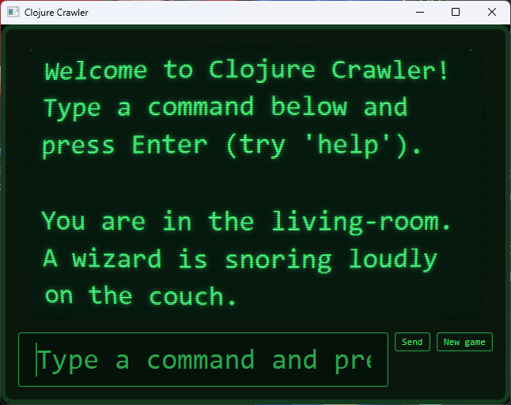

# Clojure Crawler

A small text-based dungeon crawler written in Clojure. It is a learning project inspired by [Land of Lisp](https://www.amazon.com/Land-Lisp-Learn-Program-Game/dp/1593272812) and designed to run entirely in the terminal. Requires [OpenJDK](https://openjdk.org/).



## What the game is

You start in a tiny world made up of a living room, garden, and attic. From there, you can explore rooms, read the descriptions, move between locations, pick up items, use items on things, and check what you are carrying.

There is now a goal: solve a short puzzle to unlock a hidden room and step through a portal to escape and win.

The focus is on learning Clojure and experimenting with a classic text-adventure style game loop.

## How to run it

You need Java installed to run the release jar.

From the project root, launch the packaged game with:

```powershell
java -jar .\target\clojure-crawler-0.1.0-standalone.jar
```

If you want to run it from source during development, you can also use:

```powershell
clj -M:run
```

### Graphical (GUI) version

There is also a small terminal-style window built with [cljfx](https://github.com/cljfx/cljfx) (JavaFX). It shares all of its game logic with the console version. Run it from source with:

```powershell
clj -M:gui
```

The first launch downloads cljfx and the JavaFX libraries for your platform. Type commands into the input field and press Enter (or click **Send**); **New game** restarts.

To rebuild the standalone jar:

```powershell
clj -T:build uber
```

To build a standalone jar for the **GUI** version:

```powershell
clj -T:build gui-uber
```

This produces `target/clojure-crawler-0.1.0-gui-standalone.jar`, which you can launch with `java -jar`. It bundles cljfx and the JavaFX libraries for your platform, so the GUI jar is platform-specific (built on Windows, it runs on Windows).

## Commands

Type commands at the `>` prompt.

- `look` - Describe your current location, exits, and nearby items.
- `walk <direction>` - Move to another room, such as `walk west` or `walk upstairs`.
- `pickup <object>` - Pick up an object in the room, such as `pickup whiskey`.
- `drop <object>` - Drop a carried object. A two-object form like `drop frog bucket` puts the frog into the bucket.
- `use <item> <target>` - Use an item on something, such as `use rope bucket` or `use key door`.
- `examine <object>` - Look closely at an item to read its description.
- `inventory` - Show what you are carrying.
- `help` - List all commands.
- `exit` - Quit the game.

### Shorthands

- `l` = `look`, `i` = `inventory`, `x` = `examine`, `get` = `pickup`, `h` = `help`, `q` / `quit` = `exit`.
- Directions can be typed on their own: `west` (or `w`), `east` (`e`), `upstairs` (`u`), `downstairs` (`d`), etc.

## Goal

Escape the dungeon. There is a locked door in the attic; find a way to open it and reach the portal beyond. If you get stuck, explore, `examine` things, and think about what the items in the world might do together.

## Examples

```text
> look
You are in the living-room. A wizard is snoring loudly on the couch.
There is a door going west from here.
There is a ladder going upstairs from here.
You see a whiskey on the floor.
You see a bucket on the floor.

> pickup whiskey
You are now carrying the whiskey.

> inventory
You are carrying: whiskey

> walk west
You are in a beautiful garden. There is a well in front of you.
There is a door going east from here.
You see a frog on the floor.
You see a chain on the floor.

> exit
Goodbye!
```

## Notes

- The standalone jar already includes the compiled game, so you do not need the `classes` folder to run it.
- Release builds should attach the jar from `target/` to GitHub Releases instead of committing generated files to the repository.
